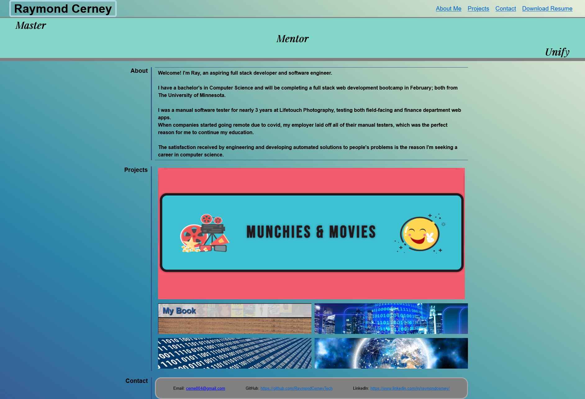

# Raymond Cerney - Portfolio

My professional portfolio, designed with many thanks to the University of Minnesota, Twin Cities coding bootcamp

## Site Contents -
### About:
Brief description of credentials and experience

### Projects:
Images linked to my projects

### Contact:
LinkedIn and contact information

## Additional Info -
### Technologies Used:
HTML & CSS

### Website:
https://raymondcerneytech.github.io/portfolio-raymond-cerney/

### Preview:

### Created By:
**Raymond Cerney**